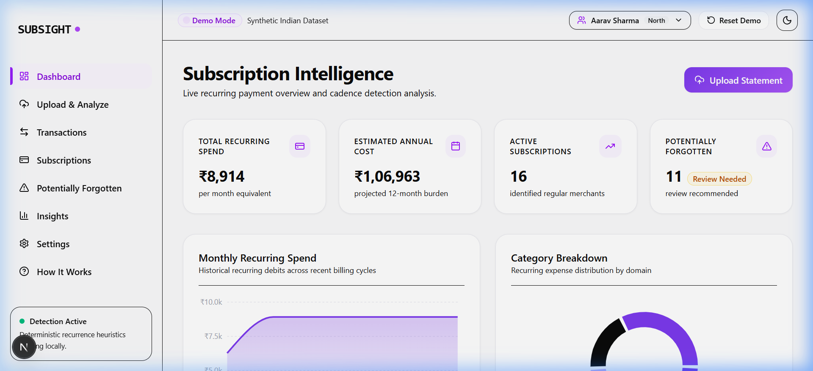
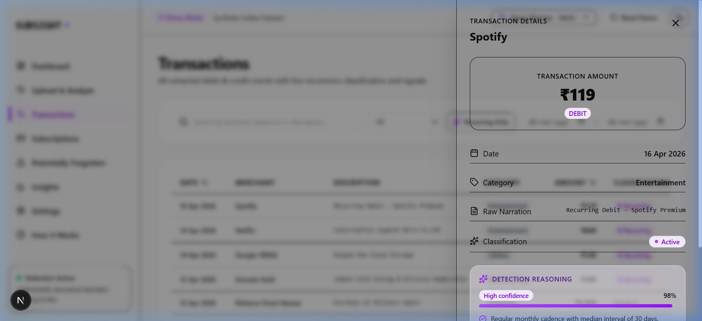
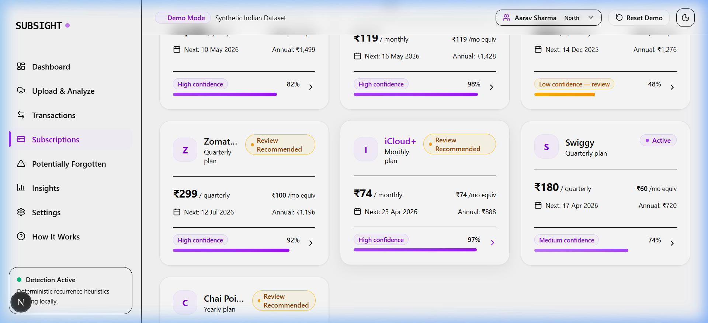
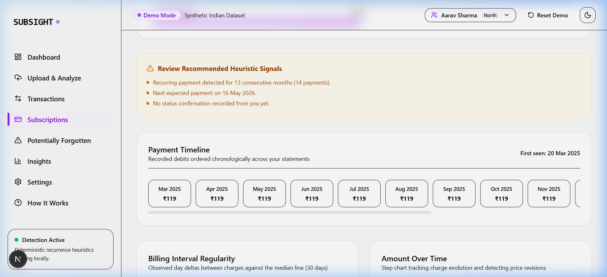
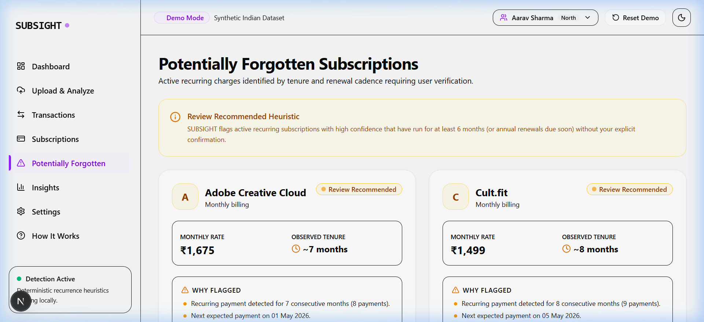
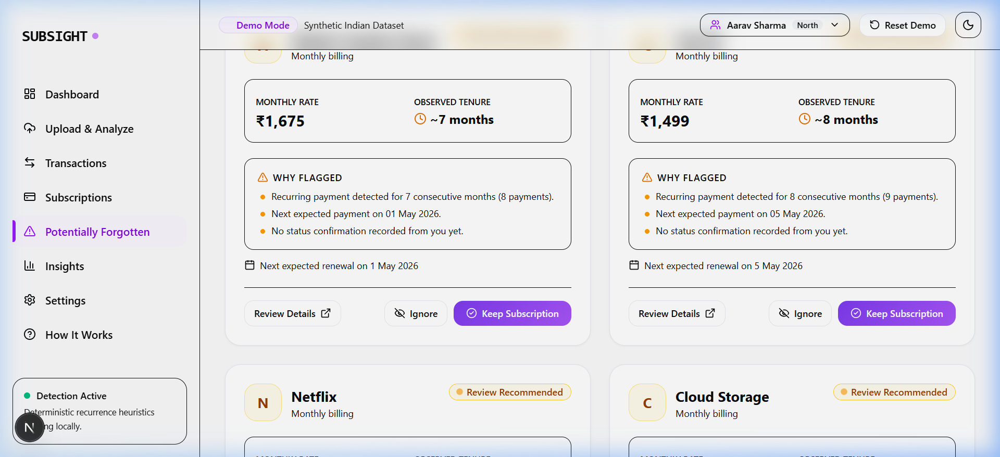
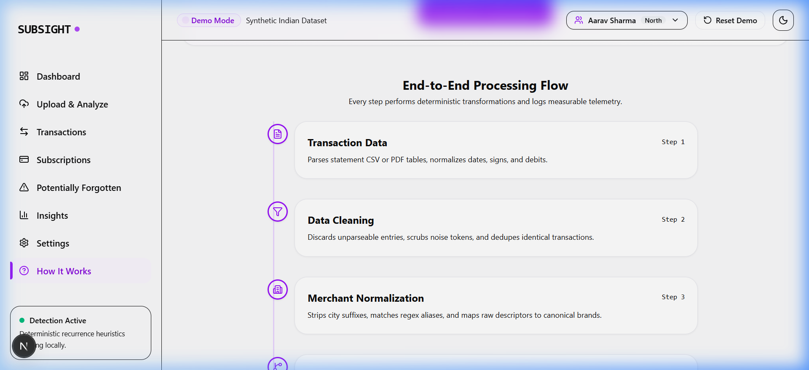
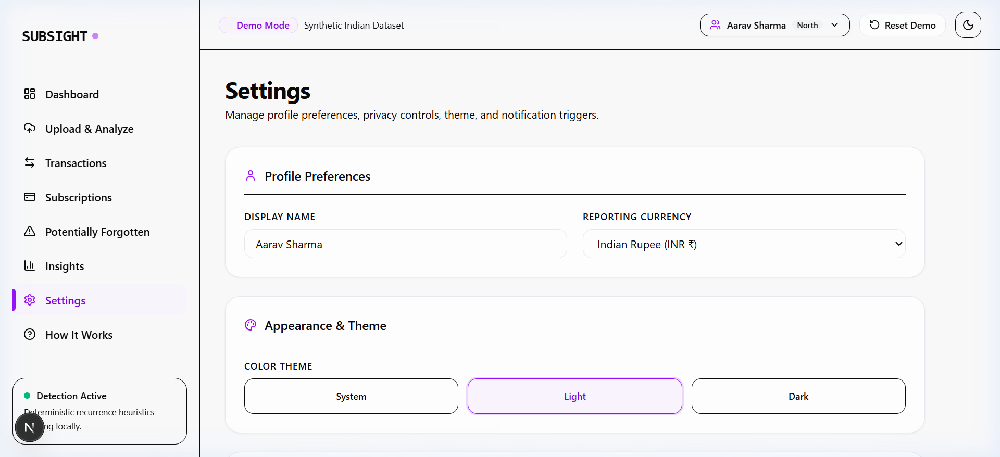
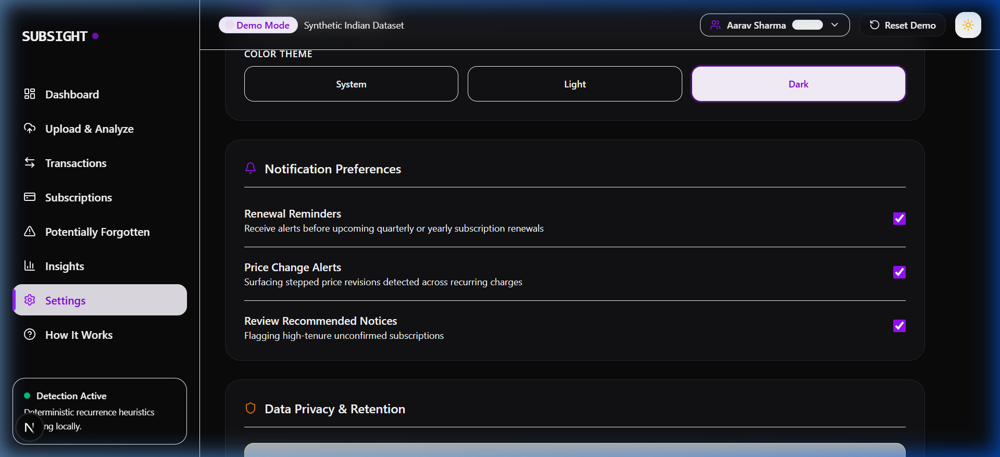

<div align="center">

# ⚡ SUBSIGHT
### Intelligent Subscription & Recurring Payment Detection Engine

*Ingest raw bank statements, clean messy merchant descriptors, detect recurring commitments, surface potentially forgotten subscriptions, and forecast financial burden — 100% deterministically and privacy-first.*

[](https://python.org)
[](https://fastapi.tiangolo.com)
[](https://nextjs.org)
[](https://tailwindcss.com)
[](https://postgresql.org)
[](#license)
[](https://subsight-app.vercel.app)

<br/>



</div>

---

## 📸 Product Screenshots & Visual Walkthrough

### 1. Interactive Analytics Dashboard
Real-time summary of monthly recurring spend, annual commitment, active subscriptions count, potential savings from review candidates, and spend distribution charts.
<p align="center">
  
</p>

---

### 2. Multi-Stage Ingestion Pipeline
Upload CSV and PDF statements with instant row preview, automatic column mapping, and 7-stage engine execution with millisecond telemetry.
| File Upload & Column Mapping | 7-Stage Pipeline Telemetry |
| :---: | :---: |
|  |  |

---

### 3. Transaction Ledger & Slide-over Drawer
Explore raw normalized debit transactions with category filtering, date sorting, and interactive drawer inspection.
| Filterable Transaction Ledger | Detailed Transaction Drawer |
| :---: | :---: |
|  |  |

---

### 4. Subscriptions Explorer & Deep-Dive Inspection
View all detected recurring subscriptions with confidence badges (High / Medium / Low), cadence, and payment history.
<p align="center">
  
</p>

Deep-dive into individual subscriptions with payment timelines, price-step increase alerts, and interval variance scatter plots:
| Subscription Metrics & Timeline | Interval Scatter Plot & Price Revision |
| :---: | :---: |
|  |  |

---

### 5. Potentially Forgotten Subscription Intelligence
Surfaces subscriptions needing review based on unconfirmed status, long tenure, and renewal proximity. Users can keep or cancel with instant state persistence.
| Review Banner & Surfaced Candidates | Interactive Keep / Cancel Actions |
| :---: | :---: |
|  |  |

---

### 6. Financial Burden Insights & Forecasting
Forecast upcoming annual subscription commitments, highest recurring expenses, and category distributions.
| Narrative Insights & Key Metrics | Yearly Spend Forecast & Comparison |
| :---: | :---: |
|  |  |

---

### 7. Explainable AI & Algorithm Proof (`/how-it-works`)
Transparent mathematical explanation of the confidence formula, interval scoring, and signal weighting.
| End-to-End Architectural Pipeline | Mathematical Confidence Formula |
| :---: | :---: |
|  |  |

---

### 8. Dark Theme & User Settings
Built-in dark mode support, notification preferences, data retention settings, and 12 pre-seeded regional demo profiles.
| Settings & Data Erasure | Sleek Dark Mode Interface |
| :---: | :---: |
|  |  |

---

## 🧠 Algorithmic Detection Architecture

SUBSIGHT uses a multi-stage, purely deterministic pipeline (no probabilistic LLM hallucinations or brittle card scrapers):

```
+---------------------+    +-------------------------+    +-----------------------+
|  Raw Statement Ingest | -> |  Merchant Normalization  | -> |  Amount Clustering    |
|   (CSV / PDF Parser)|    | (Token cleanup, Aliasing)|    | (Price Step Merging)  |
+---------------------+    +-------------------------+    +-----------------------+
                                                                      |
                                                                      v
+---------------------+    +-------------------------+    +-----------------------+
| Forgotten Detection  | <- |  Confidence Scoring      | <- |  Cadence Delta Engine |
| (Neutral Heuristics)|    | (0.00 to 1.00 Formula)  |    | (Interval Variance)   |
+---------------------+    +-------------------------+    +-----------------------+
```

### Composite Confidence Formula
$$\text{Score} = 0.35 \times S_{\text{interval}} + 0.25 \times S_{\text{amount}} + 0.20 \times S_{\text{count}} + 0.10 \times S_{\text{merchant}} + 0.10 \times S_{\text{recency}}$$

- **High Band ($\ge 0.80$):** Definite recurring subscription.
- **Medium Band ($0.62 - 0.79$):** Probable subscription (e.g. utility, variable cloud bill).
- **Low Band ($0.45 - 0.61$):** Possible pattern, requires user review.
- **Below $0.45$:** Excluded from recurring commitments.

---

## 🚀 Quickstart (Local Development)

### Prerequisites
- Python 3.11+
- Node.js 20+

### Option 1: Automatic Boot Scripts

**On Windows (PowerShell):**
```powershell
powershell -ExecutionPolicy Bypass -File scripts/dev.ps1
```

**On macOS / Linux / WSL:**
```bash
./scripts/dev.sh
# or using Makefile:
make dev
```

### Option 2: Manual Setup

1. **Backend:**
   ```bash
   cd backend
   python -m venv venv
   # Windows:
   .\venv\Scripts\activate
   # macOS/Linux:
   source venv/bin/activate

   pip install -r requirements.txt
   uvicorn app.main:app --host 127.0.0.1 --port 8000 --reload
   ```

2. **Frontend:**
   ```bash
   cd frontend
   npm install
   npm run dev
   ```

3. **Open App:**
   - **Frontend:** [http://localhost:3000](http://localhost:3000)
   - **Backend API:** [http://localhost:8000](http://localhost:8000)
   - **Swagger / OpenAPI Docs:** [http://localhost:8000/docs](http://localhost:8000/docs)

---

## 🌐 Production Deployment (100% Free Tier)

| Service | Live URL |
|---------|----------|
| **Frontend** | [https://subsight-app.vercel.app](https://subsight-app.vercel.app) |
| **Backend API** | [https://subsight-api-v2.onrender.com](https://subsight-api-v2.onrender.com) |
| **API Docs** | [https://subsight-api-v2.onrender.com/docs](https://subsight-api-v2.onrender.com/docs) |

Full instructions, environment configurations, and disaster recovery procedures are documented in [`DEPLOYMENT.md`](./DEPLOYMENT.md).

- **Backend & Database:** Render Web Service (Python 3.11) + Render PostgreSQL (`render.yaml`)
- **Frontend:** Vercel (Next.js 16 App Router) at `subsight-app.vercel.app`
- **Keep-Alive:** cron-job.org HTTP heartbeat (pings `/api/health` every 10 min)
- **Object Storage:** Cloudflare R2 (with automatic local storage fallback)

---

## 🧪 Automated Testing

Run the full backend test suite covering 100% of detection edge cases:
```bash
cd backend
pytest tests/ -v
```

Run frontend type check & production build:
```bash
cd frontend
npm run typecheck
npm run build
```

Run deployment verification script against any target environment:
```bash
python scripts/verify_deployment.py --backend http://127.0.0.1:8000 --frontend http://localhost:3000
```

---

## 🔒 Privacy Guarantee

- **Zero Bank Credentials Required:** Ingests exported statements only. No Plaid, no OAuth bank logins.
- **100% Synthetic Demo Datasets:** Pre-loaded with 12 diverse Indian profiles (Aarav, Priya, Arjun, etc.) for safe, realistic testing.
- **Instant Data Purge:** One-click statement & transaction erasure from Settings.

---

## 📄 License
MIT License. Created for hackathons, engineering demos, and personal-finance innovation.
